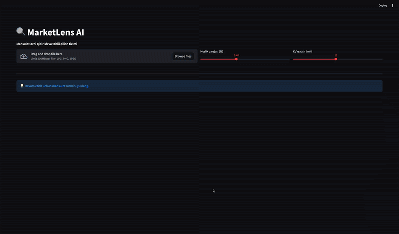
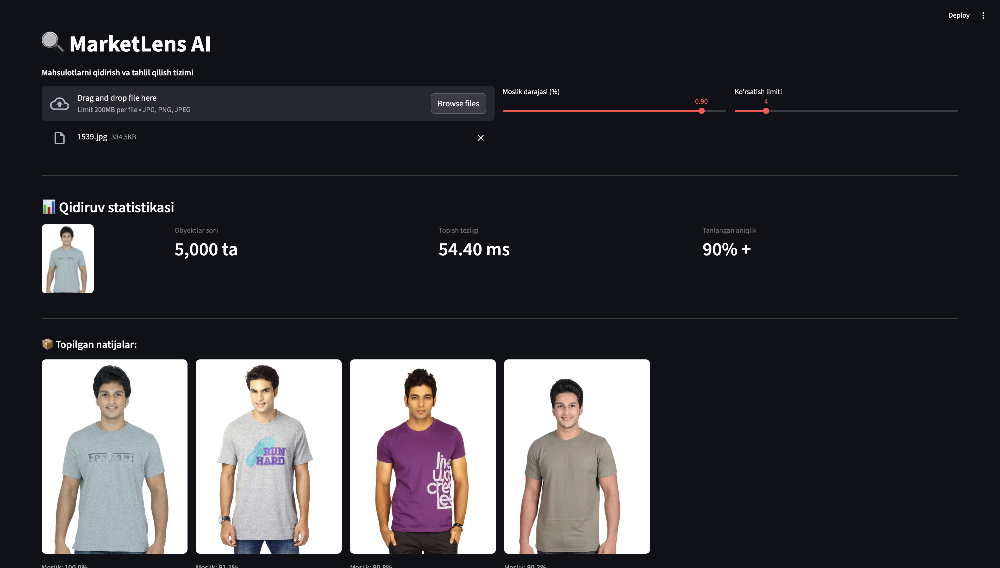
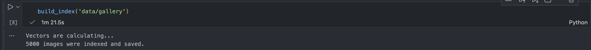

  
  

    A high-precision visual search and analysis system for e-commerce, delivering millisecond-level similarity search results from product images.
  

---

<h2 align="center" style="font-size: 1.7em; font-weight: bold; color: #2980b9;">📺 Demo & Visuals</h2>
<table width="100%">
  <tr align="center">
    <td width="50%">
      <strong>🎥 System in Action (Video)</strong>
      
<em>(Add your screen record/GIF here)</em>

      
    </td>
    <td width="50%">
      <strong>🎨 Interface Design</strong>
      
<em>(Add your interface design screenshot here)</em>

      
    </td>
  </tr>
  <tr align="center">
    <td>
      <strong>⚡ Search Speed (Metrics)</strong>
      
<em>(Add your speed metric chart here)</em>

      
    </td>
    <td>
      <strong>⚙️ Indexing Time</strong>
      
<em>(Add your indexing time chart here)</em>

      
    </td>
  </tr>
</table>

<h2 align="center" style="font-size: 1.7em; font-weight: bold; color: #2980b9;">🚀 Key Benchmarks</h2>

  

    <h3 style="color: #3498db;">📦 Database Size</h3>
    
5,000+

    images
  

  

    <h3 style="color: #e67e22;">⏱️ Search Latency</h3>
    
~54.40 ms

    per query
  

  

    <h3 style="color: #f1c40f;">🏎️ Indexing Time</h3>
    
1m 21s

    for 5k images
  

  

    <h3 style="color: #2ecc71;">✅ Accuracy</h3>
    
90%+

    similarity threshold
  

<h2 align="center" style="font-size: 1.7em; font-weight: bold; color: #2980b9;">🛠️ Technology Stack</h2>

  
  
  
  
  

<h2 align="center" style="font-size: 1.7em; font-weight: bold; color: #2980b9;">🗂️ Ma'lumotlar bazasi (Dataset)</h2>

  Bu loyihada ishlatilgan dataset mustaqil ravishda to'plangan. Tizim to'liq moslashuvchan: siz shunchaki <code>data/gallery/</code> papkasiga o'zingizning mahsulot rasmlaringizni joylashtirishingiz kifoya. Indeksni qayta yaratganingizdan so'ng (<code>python build_index.py</code>), tizim yangi rasmlar bilan ishlay boshlaydi. Hech qanday qo'shimcha konfiguratsiya talab etilmaydi.

<h2 align="center" style="font-size: 1.7em; font-weight: bold; color: #2980b9;">⚙️ Installation & Setup</h2>
<ol>
  <li>
    
<strong>Clone the repository:</strong>

    <pre><code class="lang-bash">git clone https://github.com/uzbtrust/Product-recognition.git
cd Product-recognition</code></pre>
  </li>
  <li>
    
<strong>Install dependencies:</strong>

    <pre><code class="lang-bash">pip install -r requirements.txt</code></pre>
  </li>
  <li>
    
<strong>Build the search index:</strong>

    <pre><code class="lang-bash">python build_index.py</code></pre>
  </li>
  <li>
    
<strong>Run the web application:</strong>

    <pre><code class="lang-bash">streamlit run web.py</code></pre>
  </li>
</ol>

<h2 align="center" style="font-size: 1.7em; font-weight: bold; color: #2980b9;">🤝 Contact</h2>

For any questions or suggestions regarding the project, feel free to reach out:

  
  &nbsp;
  

 

  
⭐️ If you like this project, don't forget to press the Star button! ⭐️

---

  Developed with ❤️ by uzbtrust

